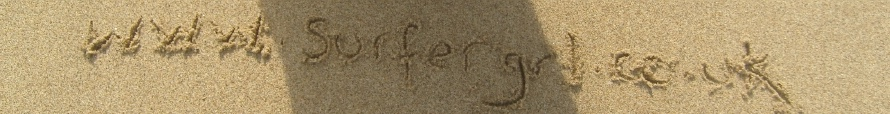

# Beach Surf Spot Database

## Kat Dawes

A simple web application for surfers to catalog and track information about different surf beaches.

This project is my third submission for the Code Institute Web Application Development course.

Available at https://onthedrop-f85390978add.herokuapp.com/

- Project Development & Planning - Project Goals
- Background
- - User Stories
    Market Review
- Scope and Structure
  - Scope
  - Structure
- Future developments
  – Skeleton
- Design & Layout
  - Colours and fonts
- Deployment
- Technologies Used
- Validation & Testing
- Credits
- Thanks

## Project Development & Planning

### Project Goals

- Create a user-friendly database for surfers to document beach spots
- Allow users to categorize beaches by wave type, spot type, and conditions
- Provide a simple interface for creating, reading, updating, and deleting beach entries
- Help surfers plan trips based on their skill level and preferred conditions

### Background

Surfers often keep mental notes or personal records about various beaches they've visited or want to visit. This application aims to digitize this process, making it easier to remember details about each location. Whether you're a beginner looking for suitable spots or an expert searching for challenging waves, having well-organized information can enhance your surfing experience.

### User Stories

- As a surfer, I want to store information about beaches I've visited so I can remember the conditions
- As a traveling surfer, I want to document new spots I discover so I can share them with friends
- As a beginner, I want to filter beaches by difficulty level so I can find suitable locations
- As an experienced surfer, I want to categorize beaches by wave type so I can find spots that match my preferences
- As a user, I want a simple interface that allows me to quickly add or update beach information

### Market Review

While there are several surf forecasting apps available (Surfline, MagicSeaweed, etc.), most focus on current conditions rather than allowing users to build their own database of spots with personalized notes. This application fills a gap for surfers who want to maintain their own records rather than relying solely on public information.

## Scope and Structure

### Scope

The application provides core CRUD functionality for beach entries with the following data points:

- Beach name
- Spot type (reef, point, beach)
- Wave direction (left, right, both)
- Offshore wind direction (N, S, E, W)
- Optimal tide conditions (low, mid, high)
- Skill level required (beginner, intermediate, expert, all)

### Structure

The application follows a simple structure:

- Main page (index): Displays all beaches in a table format with options to add, edit, or delete entries
- Add page: Form to create new beach entries
- Edit page: Pre-populated form to modify existing beach entries
- Database: SQLite database to store all beach information

### Future Developments

Potential enhancements for future versions:

- User authentication for personal beach collections
- Image upload capability for beach photos
- Rating system for beach quality
- Weather API integration for current conditions
- Map integration to visualize beach locations
- Advanced filtering and search capabilities
- Mobile-responsive design improvements
- Social sharing features
- More options for recording personal sessions – board used, weather conditions, wave caught etc.

## Skeleton

The application follows a simple three-page design:

1. Main page - Table view of all beaches with action buttons
2. Add beach form - Input fields for all beach attributes
3. Edit beach form - Pre-populated fields for updating beach information

Each page maintains the consistent header with the surf banner image and title.

## Design & Layout

### Colors and Fonts

The color scheme is based on ocean blues and white:

- Primary blue: #2196f3 - Used for header, buttons, and accents
- Dark blue: #0d47a1 - Used for hover states and primary buttons
- Light blue background: #f5f9ff - Creates a fresh, airy feeling reminiscent of the beach
- White: #ffffff - Used for content areas and forms
- Table header blue: #2196f3 - Creates visual separation for data

Typography:

- Arial, sans-serif: Clean, readable font that works well across devices
- Buttons and interactive elements feature slightly bolder text

## Deployment

### Local Deployment

1. Clone the repository
2. Install required dependencies:
   pip install flask
3. Run the application:
   python app.py
4. Access the application at http://127.0.0.1:5000

### Production Deployment

Heroku

1. Ensure `debug=False` in app.py
2. Create app in Heroku
3. Create config variables
4. Clone repo and link git to Heroku
5. The application is available at https://onthedrop-f85390978add.herokuapp.com/

## Technologies Used

- **Python**: Core programming language
- **Flask**: Web framework for routing and templating
- **SQLite**: Database for storing beach information
- **HTML/CSS**: Frontend structure and styling
- **JavaScript**: Minimal use for confirmation dialogs
- **Git**: Version control
- **SQLAlchemy** (future improvement): For more robust database interactions

## Validation & Testing

### Manual Testing Procedures

- Form Validation: Tested required fields and dropdown selections
- CRUD Operations: Verified all create, read, update, and delete functions
- Responsive Design: Tested on various screen sizes
- Browser Compatibility: Tested on Chrome, Firefox, Safari, and Edge

### Validation

- HTML validation using W3C Markup Validation Service
- CSS validation using W3C CSS Validation Service
- Python validation using PEP8 online checker

### Known Issues

- Currently no user authentication - all users can modify all data
- No confirmation for successful operations (future improvement)
- Limited responsiveness on very small mobile screens

## Credits

- Flask documentation: https://flask.palletsprojects.com/
- SQLite documentation: https://www.sqlite.org/docs.html
- Design inspiration from Surfline, The Inertia and WSL websites
- CRUD database tutorials: https://budibase.com/blog/crud-app/ https://www.metabase.com/learn/metabase-basics/querying-and-dashboards/actions-crud and https://www.google.com/url?sa=t&source=web&rct=j&opi=89978449&url=https://www.youtube.com/watch%3Fv%3DayAX10M8b3Q&ved=2ahUKEwizjPnq3qCNAxULRfEDHTiZF0AQwqsBegQIDBAF&usg=AOvVaw0g6ltwN_oxxdGDY3xxwZdY

## Thanks

- Thanks to the local surf community who inspired this project
- Special appreciation to all test users who provided feedback - Sam, Vinny, Pob
- Thanks to Oisin and Roman for webinar on virtual environments and package compatibility

---
